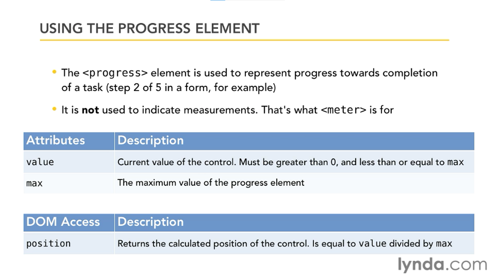
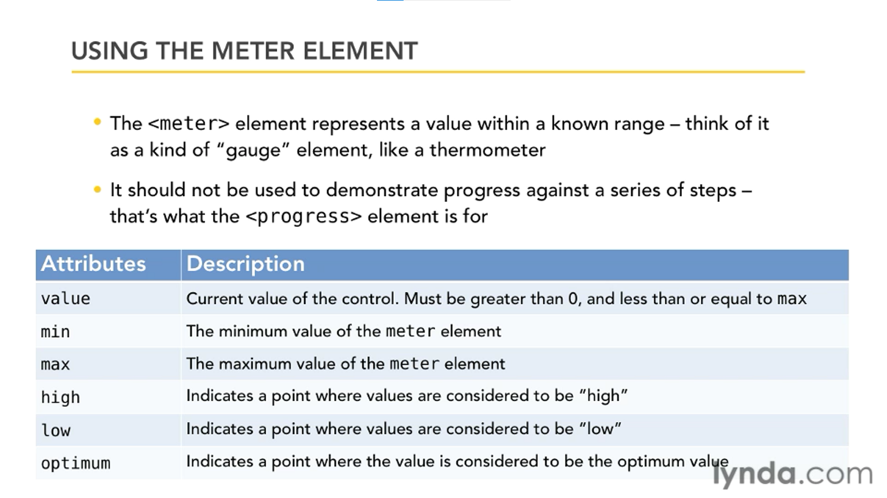
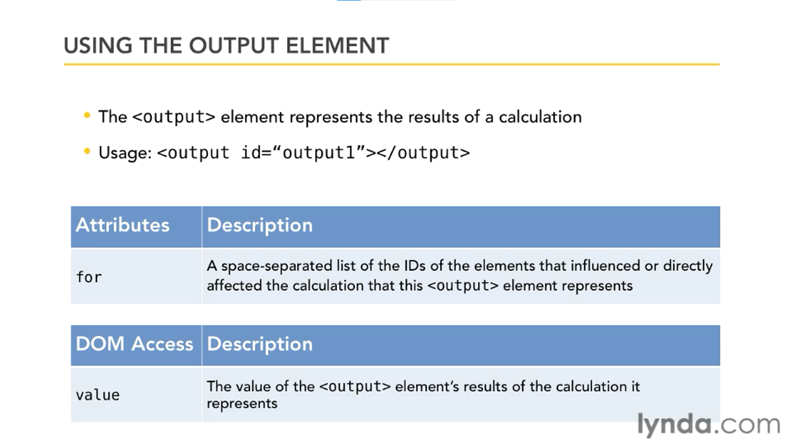

# New Form Elements

HTML5 has some new form elements. Like,
- `datalist`
- `progress`
- `meter`
- `output`
- `keygen`

Learn more here: [HTML5 Forms: New Controls](https://www.sitepoint.com/html5-forms-new-controls/)

## Progress Element

Thing to remember! ⚠

## Meter Element

Here also! ⚠

# Output Element

Yeap! again ⚠

